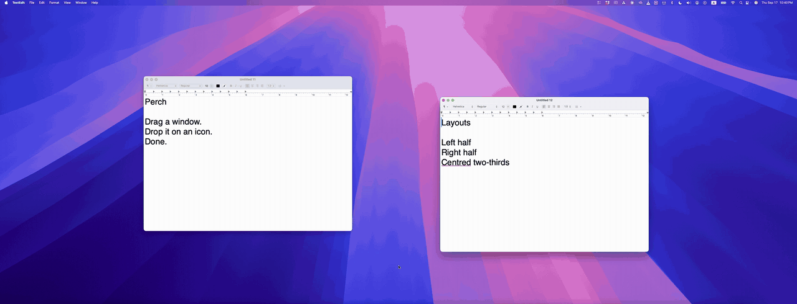

# Perch

**Drag a window. Drop it on an icon. Done.**

Perch is a small macOS window manager with one idea: while you are dragging a
window, a strip of layout icons appears. Drop the window on one and it snaps
there. No hotkeys to memorise, no modifier key to hold, no aiming the cursor
into a zone first.



```
   drag a window ──▶  ▮▯  ▯▮  ▤  ▬▭  ◰  ◱  ◲  ◳  ■   ──▶  drop on one
                      the strip appears mid-drag           it snaps there
```

---

## Why another window manager

There are a lot of good ones. They mostly ask you to do one of these:

| App | How you move a window |
|---|---|
| macOS tiling | Drag to a screen edge, or `fn`+`ctrl`+arrows |
| Magnet, Rectangle | Keyboard shortcuts, or drag to an edge |
| Loop | Hold a hotkey, flick the mouse toward a radial menu |
| MacsyZones | Hold Shift, aim the cursor into a zone, then drop |
| Moom | Hover the green button, pick from a palette |

Perch asks for one motion: drag, drop on the icon you want. The icons come to
you, you do not go looking for them.

This is the interaction the late [Window Tidy](https://www.lightpillar.com/window-tidy.html)
had. It was discontinued in 2018 and is Intel-only, so it no longer runs on
Apple Silicon. [Mosaic](https://www.lightpillar.com/mosaic.html), by the same
developer, is the actively-maintained commercial descendant and is worth your
money if you want more features than this. Perch is the small free one.

## Requirements

- macOS 13 Ventura or later
- Apple Silicon or Intel (universal binary)

## Install

**Download** the latest `.dmg` from
[Releases](https://github.com/zhan-li/perch/releases), open it, and drag
**Perch** onto the Applications shortcut.

**First launch.** Perch is signed with a self-signed certificate rather than a
paid Apple Developer ID, so Gatekeeper refuses the first open. Either:

- **Right-click** the app ▸ **Open** ▸ **Open** in the dialog, or
- run `xattr -dr com.apple.quarantine /Applications/Perch.app`

Once per install, not once per launch.

**Grant Accessibility** when prompted — System Settings ▸ Privacy & Security ▸
Accessibility. Perch needs it to move and resize other apps' windows. That is
the only reason. Nothing is collected and nothing leaves your machine; there is
no network code in this repository.

### Updating

Drag the new build over the old one. **Your Accessibility grant carries over** —
there is nothing to re-tick.

Releases are signed with a stable certificate, so the requirement macOS files
alongside your grant pins that certificate:

```
designated => identifier "com.zhanli.perch" and certificate leaf = H"358e78f5…"
```

That value is identical in every release, so the grant keeps matching.

### Coming from 1.2.1 or earlier: one extra step

Releases up to and including 1.2.1 were signed **ad-hoc**, which pins the *code
hash* instead — and that changes on every build. Each release therefore
invalidated the grant belonging to the one before it, while System Settings went
on showing the toggle switched **on**, because that list is keyed by bundle path
rather than by signature.

Switching the toggle off and on does not fix it. It does not rebind the stored
requirement, and every release you installed left another dead entry behind.

Clear them once:

```bash
osascript -e 'quit app "Perch"'
tccutil reset Accessibility com.zhanli.perch
open /Applications/Perch.app
```

Then tick Perch in System Settings ▸ Privacy & Security ▸ Accessibility. This is
needed **once**, on the upgrade to 1.2.2. Every update after it keeps the grant.

`tools/install-latest.sh` performs this whole sequence — download, replace,
strip the quarantine flag, clear the stale entries, relaunch:

```bash
curl -fsSL https://raw.githubusercontent.com/Zhan-Li/perch/main/tools/install-latest.sh | bash
```

Note that it clears the entries on *every* run, so it always costs you a
re-tick. That is what you want when migrating off an ad-hoc build, and
unnecessary afterwards — for routine updates, just drag the DMG.

## Build from source

No Xcode required — Command Line Tools are enough.

```bash
git clone https://github.com/zhan-li/perch.git
cd perch
./build.sh                    # universal binary → build/Perch.app
PERCH_ARCH=native ./build.sh  # faster single-arch dev build
open build/Perch.app

./release.sh 1.0.0            # universal build packaged as dist/Perch-1.0.0.dmg
```

Releases are automated: pushing a `v*` tag runs
[`.github/workflows/release.yml`](.github/workflows/release.yml), which builds
the universal binary on a macOS runner, verifies both architectures are
present, packages the DMG and publishes it.

```bash
git tag v1.0.0 && git push origin v1.0.0
```

The build ad-hoc signs by default. Because an ad-hoc signature pins the code
hash, macOS revokes Accessibility access on every rebuild. For development,
create a stable self-signed certificate once and the grant survives rebuilds —
see [docs/DEVELOPING.md](docs/DEVELOPING.md).

## Layouts

Nine defaults ship, including **centred two-thirds**, which is the one that
earns its keep on an ultrawide. Edit them from the menu bar ▸ **Edit Layouts…**
(`⌘,`).

A layout is a rectangle of cells on a grid, so you set the divisions and then
drag across the cells the window should fill. Two-thirds centred needs a
6-column grid at `x:1, w:4` — a 3-column grid cannot express it without half
cells.

Layouts live in `~/Library/Application Support/Perch/zones.json` if you would
rather edit text.

## Known gaps

Honest list. Contributions welcome on any of these:

- No keyboard shortcuts — mouse only, by design, but some people want both
- Untested against Stage Manager and full-screen Spaces
- No "restore previous size" / undo
- No per-layout target display on multi-monitor setups
- Fixed-size settings window, hand-laid-out frames, not localised
- The icon is programmer art, generated by `tools/make-icon.sh`

## Support the project

Perch is free and always will be. If it saves you some time,
[buy me a coffee](https://github.com/sponsors/zhan-li).

## License

MIT — see [LICENSE](LICENSE).
